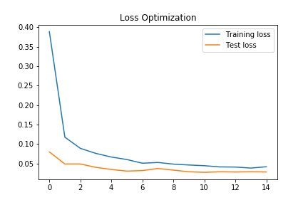
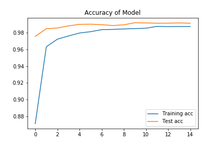

# Digit-Recognizer

This project is based off my submission for the Kaggle Digit Recognizer  [competition](https://www.kaggle.com/c/digit-recognizer). I was able to score 0.99057 accuracy out of the 28,000 test set. At the time of this posting, I was top 30% of all submissions.

### The Problem
The goal of this project is to correctly identify thousands of hand-drawn digits. This can be done with any method, but I have chosen to use a convolutional neural network (CNN). CNNs work well with image processing as it can reduce the amount of features a neural network uses at any given point in time. Less features used will allow us to save time, which would be money in real world problems.

### The Data
As with any problem, it is good to understand the data. Data has been provided as a training and test set, where the training set is labeled and the testing set isn't labeled.

  

<caption align="bottom">Figure 1. Testing Set Images</caption>

The data contains hand drawn images that are 28 pixels in height and 28 pixels in width, for a total of 784 pixels in total. Each pixel has a value associated with it to indicate darkness of that pixel. The pixel-values are integers between 0 and 255, inclusive. This is only a 28 x 28 image, but it has 784 features. Therefore, a neural network is the best approach.

### The Model
The model is created using the Keras deep learning library as it seems more intuitive. The layers consist of a combination of convolutional, pooling, dropout, and dense layers.

The first two layers applies filters to the image to help the model identify different components such as edges. Then pooling layers are used because neighboring pixels generally are related in images. This will allow grouping to help identify portions of the image.

Dropout needs to be used to intentionally turn off nodes within the hidden layers. This makes the model make different connections on the features, the same features might not be available in each pass of the training process. This will ultimately reduce the chances of overfitting.

In addition to dropout, the NN is only trained for 15 epochs (training steps) to avoid overfitting. The following graph shows the NN being trained and is stopped before overfitting can occur. Loss is being optimized as opposed to accuracy because the true testing set does not come with solutions.

  

<caption align="bottom">Figure 2. Model Fitting</caption>

  

<caption align="bottom">Figure 3. Model Fitting</caption>

### The Results
I was able to score relatively high considering this was my first project using a Keras NN. I believe there is still room for improvement with image augmentation to increase my training set. With additional data, the NN could be better optimized to increase the final accuracy score.
